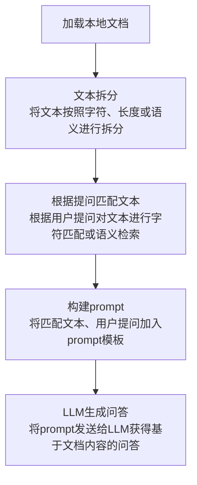
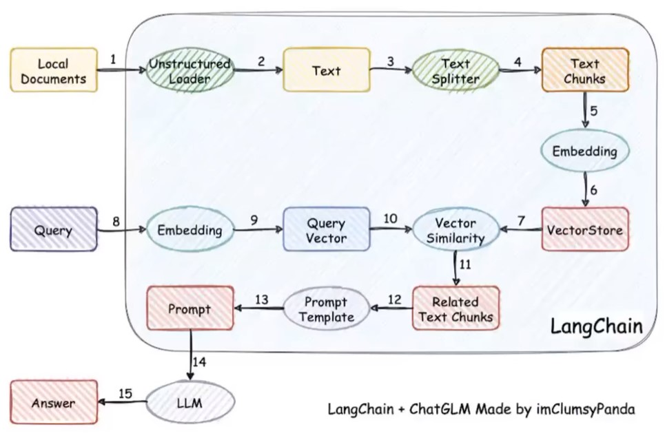

# 常见两类LLM工程
| 模型工作 | 解释 | 应用场景 |
|-----------|------|-----------|
| 微调 | 针对预先训练的语言模型，在特定任务的少量数据集上对其进行进一步的训练 | 当任务或域定义明确，并且有足够的标记数据可供训练时，通常需要使用微调 |
| 提示词工程 | 涉及设计自然语言提示或指令，可以指导语言模型执行特定任务 | 最适合需要高精度和明确输出的任务。提示工程可用于制作引发所需要输出的查询 |

# Langchain
Langchain是一种应用程序框架，用于开发由语言模型驱动的应用程序。

## 主要功能
* 调用语言模型
* 将不同数据源接入到语言模型的交互中
* 允许语言模型与运行环境交互

## 主要模块
| 模块名称 | 功能 |
|-----------|------|
| Modules | 支持的模型类型和集成 |
| Prompt | 提示词管理、优化和序列化 |
| Memory | 内存是指在链、代理调用之间持续存在的状态 |
| Indexes | 当语言模型与特定于应用程序的数据相结合时，会变得更加强大，此模块包含用于加载、查询和更新外部数据的接口和继承 |
| Chain | 链是结构化的调用序列 |
| Agents | 代理是一个链，其中LLM在给定高级指令和一组工具的情况下，反复决定操作、执行操作并观察结果，直到高级指令完成 |
| Callbacks | 回调允许你记录和流式传输任何链的中间步骤，从而轻松观察、调试和评估应用程序内部 |

## 应用场景
| 场景 | 解释 |
|------|------|
| 文档问答 | 基于特定的文档回答问题，答案仅来源于这些文档 |
| 个人助理 | 个人助理采取行动，记住互动，了解用户的数据 |
| 查询表格数据 | 使用语言模型查寻库表类型结构化数据 |
| 与API交互 | 使用语言模型与API交互，访问最新信息并于此采取相应行动 |
| 信息提取 | 从文本中提取结构化信息 |
| 文档总结 | 压缩长文档，一种数据增强生成 |

# 基于本地知识的问答
## 实现原理
### 基于单一文档问答

### 基于本地知识库问答

# Langchain-ChatGLM
## 项目结构
| 模块名称 | 功能 |
|-----------|------|
| models | LLM的接口类与实现类，针对开源模型提供流式输出支持 |
| loader | 文档加载器的实现类 |
| textsplitter | 文本切分的实现类 |
| chains | 工作链路实现，如chains / local_doc_qa 实现了基于本地文档的问答实现 |
| content | 用于存储上传的原始文件 |
| vector_store | 用于存储向量库文件，即本地知识库本地 |
| configs | 配置文件存储 |

# 优化方向
